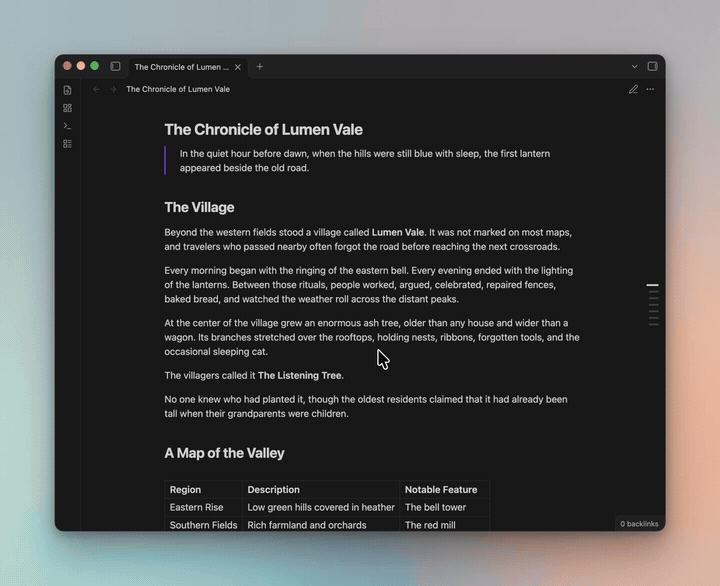

# Margin Rail

Find your place in a long note without opening a sidebar. Margin Rail is a
**scrollspy**: a slim set of heading markers along the edge of your note.
Hover for a preview, click to jump, or drag to scroll. Works while reading and editing.

[Watch the full video](https://github.com/Mars-den/margin-rail/blob/main/images/margin-showcase.mp4).

## Install

In Obsidian, open **Settings → Community plugins → Browse**, search for
**Margin Rail**, then install and enable it. You can also find it on the
[community plugins page](https://community.obsidian.md/plugins/scrollspy-rail).

Requires **Obsidian 1.2.7 or later**. [Compatibility details below](#compatibility-and-privacy).

Install manually

Download `main.js`, `manifest.json`, and `styles.css` from the
[latest release](https://github.com/Mars-den/margin-rail/releases/latest).
Inside your vault’s `.obsidian/plugins/` folder, create a folder with the name
shown in the `id` field of `manifest.json`. Put the three files there, restart
Obsidian, and enable **Margin Rail** in Community plugins.

## Using the rail

Open a note with a few headings. Each small bar represents a heading, and the
highlighted bar shows where you are.

- **Hover** over a bar to see its heading. Labels can also show a short text
  preview and how far down the note the heading is.
- **Click** to navigate to that mark using your selected tracking rule.
- **Drag** up or down along the rail to scroll through the note.
- **Scroll or swipe over the rail** to browse headings when the outline is taller than the pane.
- **Keyboard**: Tab to the rail, use Up/Down or Home/End to select any heading,
  including nested headings, then Enter to jump. Escape dismisses the label.
- **Bookmark** a heading with the button on its label. Click it again to remove
  the bookmark. Saved headings have a dot beside their bar.

Bookmarks use Obsidian’s **Bookmarks** core plugin, so it needs to be enabled.
You can show or hide the bookmark button under **Settings → Margin Rail → Labels**.

## Make it yours

Open **Settings → Margin Rail** to adjust the look and behaviour. Changes appear
immediately in the live preview and your open notes. Start with a preset:

| Preset | What it looks and feels like |
|---|---|
| **v2** · default | Slim bars that grow near your pointer, with heading previews and a bookmark button. |
| **Absolutely** | Claude-inspired styling: fine, widely spaced marks on the left with simple labels. |
| **Quiet** | A subtle rail with simple heading labels. |
| **Outline** | Indented bars and heading-level labels to show your note’s structure. |
| **Progress** | Equal scroll shares, square marks with a hover swell, and section progress filling from right to left. |

Use **Normal** for named choices for mark shape, length, spacing, emphasis, hover,
labels, and placement. **Advanced** exposes individual sliders and exact numeric
inputs. Both edit the same values: Normal shows a matching choice automatically,
or **Custom** when the values do not match. Switching modes preserves your setup.

Hover options include **Still**, **Swell**, **Heading badge**, **Focus** (frame the
pointed mark and dim its neighbours), and **Dot** (morph the mark into a circle).
Advanced lets you tune the badge and dot sizes. Labels have separate **Show and
hide** (**None**, **Fade**, **Slide**) and **Between marks** (**None**, **Slide**)
animations, with speed choices in Normal and exact durations in Advanced. Label
animations respect reduced motion. Absolutely uses Slide for both; Progress
keeps both off.

Align marks to the left, centre, right, or the rail’s side. Section progress can
fill from left to right, right to left, or outward from the centre.

Use **Save as…** to name a new preset. The preset options menu holds reset and
delete actions. Changes to a preset show as **Custom (unsaved)** until you save them.
**Update** appears after edits and saves over the preset you started from; use its dropdown to choose
another saved preset. Updating a built-in creates a local copy. If the starting
preset is unknown or was deleted, choose a destination before updating.
Your phone visibility choice stays the same when switching presets.

## How headings follow your scrolling

Choose a rule under **Behaviour → Scroll tracking** and try it with the preview’s scroll slider.

| Setting | What happens |
|---|---|
| **Follow the note** | A heading becomes current when it reaches the top of the note area. |
| **By section length** | Longer sections stay current for more of your scrolling. Every heading gets a turn. |
| **Equal shares** | Every heading stays current for the same amount of scrolling. |
| **No tracking** | Use the rail to navigate without highlighting a current heading. |

With **By section length**, navigation places the heading 24px below the top of
the note area when space allows. That same landing position starts its tracking
range, which continues to the next heading’s landing position. Ranges follow the
rendered layout, including wrapped text and images. Near the bottom, where a
heading cannot reach the top, trailing ranges use the remaining scroll space.
Short or empty sections borrow some scroll space from the preceding section,
while keeping their headings visible. Their headings may therefore land lower. Very short notes may not have enough scroll space for distinct ranges.

**Equal shares** keeps equal portions of the scroll range for each heading;
navigation prefers showing the heading within its assigned portion.
Opening a heading bookmark from Obsidian or following a heading link uses the
same landing rule as clicking a mark.
**Follow the note** and **No tracking** keep Obsidian’s exact heading jumps.

Under **Behaviour → Heading navigation**, you can enable **Place cursor at heading**
for editing mode and **Briefly highlight heading** for a fading destination highlight
in either mode. Both are off by default and are independent of presets.

On Mac, **Haptic ticks while dragging** adds subtle trackpad feedback when a rail
drag crosses a section boundary. It is off by default, stays independent of
presets, and adds no feedback to clicks or ordinary scrolling. Requires a
compatible Force Touch or Magic Trackpad with system haptics enabled. A small
helper uses macOS’s built-in `osascript` and AppKit only during a drag; no extra
binary or installation is required. Fast crossings are rate limited rather than
queued. This option does not change phone behaviour.

While dragging with section-length or equal-share tracking, each mark’s pointer
area maps to that heading’s scroll range. The label follows the selected section
without animation lag, and each crossing has a brief landing detent and a small
mark pulse. Fast dragging smoothly reduces the heading holds, pulses and haptic
ticks; slowing down restores them without pulling the note backwards. Speed is
measured in marks per second so rail spacing does not change the feel.
Dense outlines bring the selected mark beneath the cursor; folded
headings remain reachable during the drag. Reduced motion disables the pulse.

On touchscreens, taps select the mark originally pressed and long outlines scroll
with a native swipe. Rail gestures do not trigger Obsidian’s pull-down command.
Touch labels omit the quick bookmark button; using a mouse, trackpad, or keyboard
restores it, including on iPad. Heading navigation uses precise pixel landings so
closely spaced headings activate their own marks.

**By section length** is the default for new installations. Existing saved choices
are preserved. Nested headings each start their own range.

**Finish on the last heading** highlights the final heading when you reach the
bottom of a scrollable note. It works with any rule, including **No tracking**
if you only want a highlight at the very end.

You can also highlight other headings that are on screen, fade sections you’ve
passed, or let the current bar fill as you move through its section.

## On your phone

The rail is hidden on phones by default. To enable it, go to
**Settings → Margin Rail → Placement → On phones** and choose **Landscape only**
or **Show on phones**. The settings preview is always available.

## If the rail doesn’t appear

Check **Placement**: the rail can hide on notes with too few headings, narrow
desktop or tablet panes, or phones. Run **Margin Rail: Refresh rail and show status**
from the command palette to refresh it and see what might be keeping it hidden.

Still having trouble? [Open an issue](https://github.com/Mars-den/margin-rail/issues)
with your Obsidian version, device, whether you were reading or editing, and
what happened.

## Compatibility and privacy

Margin Rail works locally. It doesn’t send network requests or collect usage data.

Desktop testing includes Obsidian **1.12.7** and **1.14.4**, and the plugin has
also been tested on iPhone. Support back to **1.2.7** is based on checking that
version’s code and APIs; it hasn’t been tested by hand on that version. Reports
from older versions, Android devices, and tablets are welcome.

Scrolling and bookmarks rely on some parts of Obsidian that aren’t official
plugin APIs. Those can change when Obsidian updates, so an update could affect
these features.

For developers

Plain JavaScript and CSS; no build step. Run `node scripts/verify.cjs` for all
checks. Optional browser layout and interaction checks use Playwright with an
installed Chromium: `node tests/browser/navigation.cjs`. Set `PLAYWRIGHT_MODULE`
to its module path if it is not installed locally. Touch regressions run in Chromium
and WebKit with `node tests/browser/touch.cjs` (install both Playwright browsers).
To release, commit on the branch tracking `origin/main`, then run
`node scripts/release.cjs <next-version>`. GitHub Actions checks, attests, and
publishes the plugin files.

## License

[MIT](LICENSE) — you’re welcome to use, modify, and share it under that license.

Maintained by [Mars-den](https://github.com/Mars-den).

Developed using AI assistance.
