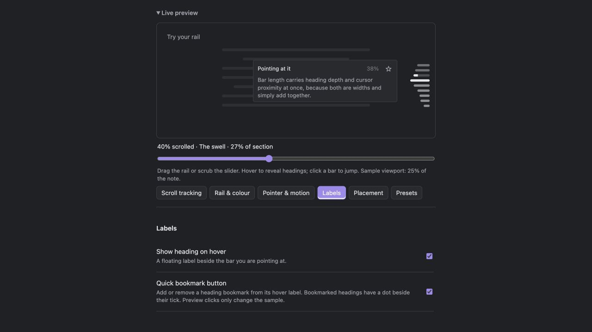

# Margin

A compact heading rail for long notes in Obsidian. See where you are, hover for a
heading preview, and jump or drag to navigate without keeping a sidebar open.



- Track headings by their position, section length, or equal scroll shares.
- Show section progress, passed headings, and nearby heading levels.
- Bookmark a heading from its label; saved headings get a dot beside their tick.
- Tune the rail in a live settings preview, or choose v1, Quiet, Outline, or Progress.
- Choose whether phones show the rail: hidden, landscape only, or both orientations.

## Install

Requires **Obsidian 1.14.4 or later**. Desktop and iPhone testing informed this
release; Android and tablet testing is still welcome.

Until this plugin is listed in Obsidian’s community directory:

1. Download `main.js`, `manifest.json`, and `styles.css` from the
   [latest GitHub release](https://github.com/PZTHH/margin/releases/latest).
2. Create `.obsidian/plugins/scrollspy-rail/` inside your vault and put those three
   files in it.
3. Restart Obsidian, enable community plugins, and enable **Margin**.

For phones, use **Settings → Margin → Placement → On phones**. The default
hides the rail on phones to keep the small screen clear. The settings preview is
always available.

## Privacy and compatibility

The plugin works locally. It makes no network requests and collects no telemetry.
The bookmark button uses Obsidian’s enabled Bookmarks core plugin. Scroll mapping
and bookmark integration use guarded internal APIs, which can change between
Obsidian releases. If something breaks, please report the Obsidian version,
device, reading/editing mode, and steps to reproduce in
[GitHub Issues](https://github.com/PZTHH/margin/issues).

## License

[MIT](LICENSE). You may use, modify, and redistribute it under that license.
Developed with AI assistance; maintained by [PZTHH](https://github.com/PZTHH).

## Configuration

The tab opens on a **live preview**: a real rail, built from the same `RailView`
class as the one in your notes, driven by sample headings and sat against stand-in
body text. Pointing at it produces the actual wave, hovering shows the actual label,
clicking a bar moves the current-section marker. Every setting below it is visible up
there before you go hunting for it in a note.

That is the reason `RailView` exists as a base class. `DocumentRail` binds it to a
markdown pane, `PreviewRail` binds it to the sample — so the preview cannot drift from
the real behaviour, because it *is* the real behaviour.

Settings are grouped by purpose: **Scroll tracking**, **Rail & colour**,
**Pointer & motion**, **Labels**, **Placement**, and **Presets**. Related controls
stay together; choosing an effect reveals its own controls. There is no advanced
switch hiding the choice that makes a visible control relevant.

The preview and controls share Obsidian’s normal settings scroll area, so the last
control stays reachable even in a short window. Click **Live preview** to collapse
the sample and simulator; the category buttons remain accessible. This preference
is remembered independently of presets. A scroll slider
runs the same tracking calculation as the document rail, with the chosen heading
and scroll percentage shown explicitly. Allocation modes also draw a clickable
strip of heading shares. Scrubbing or switching rules keeps the simulated scroll
position, so differences are easy to compare.

Sliders carry a standing numeric readout with units. Appearance uses CSS custom
properties; changes to behaviour refresh the preview and open document rails.
Idle, current, pointer-nearby, and passed visibility can be adjusted separately.
Current and passed headings can each add length to their resting bars.

**v1** is the default preset: slim neutral ticks, uniform lengths, focused wave
hover, section-length tracking, and labels with percentages, text, and a bookmark
button. Three alternatives are included: **Quiet** for title-only labels and a
minimal rail, **Outline** for all heading levels with indentation and H-level
pills, and **Progress** for equal scroll shares with section fills. Saved presets
remain available alongside the built-ins.

## Length carries two signals

Bar length is the only channel the rail has, and it carries all of these at once —
they're widths, so they add, and a single bar can show every one of them:

- **Heading level**, as a fixed indent subtracted per level of nesting.
- **Cursor proximity**, as a dock-style swell added on top — a raised cosine raised
  to a focus exponent. Focus 1 spreads growth evenly across neighbours; higher values
  put nearly all of it on the single nearest bar. Either way it reaches exactly zero
  at the configured distance, so nothing snaps.

- **Being the current section**, as an optional standing bonus on top of both.

None needs to know about the others, and the shape of the rail tells you where you
are and what you're pointing at in one read.

## What counts as "current"

Choose one of four tracking rules:

| Rule | How it chooses the current heading |
|---|---|
| Follow the note | The latest heading to reach the top of the viewport. |
| By section length | Divide the entire scroll range by each section’s source-line length. |
| Equal shares | Divide the entire scroll range evenly among headings. |
| No tracking | Leave the rail available for navigation without a current marker. |

Both allocation rules give every heading a positive interval, including headings
near the end that cannot physically reach the top. Section lengths run from one
heading to the next, with text before the first heading included in its share.
Nested headings are separate sections. Weights use source lines, not rendered
pixel heights, so wrapping and code blocks do not change the allocation.

**Finish on the last heading** is independent of the rule. Turn it on to choose
the last heading at the bottom of a scrollable note. Combine it with No tracking
to highlight only the final heading at the end; turn it off for purely manual
navigation. A note with no scroll range does not trigger the bottom override.

Highlight either **Current heading** or **Also on screen**. The latter adds
headings actually visible in the viewport to the one selected by the rule.
Passed-heading styling always follows that single selected heading. No tracking
turns off visible-heading highlighting as well.

### Working out what's on screen

The obvious approach — total lines × the fraction of the scroll range on screen —
is wrong, and wrong in the worst place. It assumes every source line renders to the
same height, but a screenful of headings and list items covers far more lines than a
screenful of a table or a code block. So it overshoots exactly where headings are
dense, which is exactly where you'd notice.

Both editors can answer properly, so `visibleRange()` asks them:

- **Editing and live preview** — CodeMirror's `posAtCoords()` maps viewport
  coordinates to document positions, including for lines it hasn't rendered.
- **Reading mode** — the preview renderer tracks which source lines each laid-out
  section covers. This is undocumented, hence the guards.

The proportional guess survives only as a last resort, with its flaw noted in place.

### The last heading

A heading near the end of a note can never reach the top of the viewport.
The optional bottom override solves that for physical tracking. Allocation modes
also make intermediate headings near the bottom reachable by assigning each its
own scroll interval. Follow the note with the bottom override remains the default.

The plugin writes `--ss-boost` per bar on each animation frame; the CSS does the sum.
Tick centres are measured once when the pointer enters the rail rather than per frame,
because a bar's centre never moves while it's growing — the work per frame is
arithmetic, not layout.

## Navigation while pointing

**Drag to scrub** is on by default. Hold the rail and move up or down to scroll
continuously across the note's full pixel scroll range. The first and last visible
bar centres are the start and end; moving beyond them clamps to the note's ends.
Pointer capture keeps the gesture working outside the rail. The track stays fixed
while dragging, so revealing a heading or changing the current heading cannot move
it beneath your pointer. Releasing a drag does not trigger a heading jump. A short
press still jumps to the selected heading. Turn it off under **Pointer & motion**.

**Reveal nearby** keeps two heading levels visible at rest, relative to the note's
shallowest level. Hover a heading to reveal the deeper headings in that branch;
leave the rail to fold them away. The pointed heading stays in place when its
branch opens, and the current heading stays visible even when nested. Choose
**All headings** or change **Levels shown at rest** under **Rail & colour**.

**Show progress within the section** fills the current bar from left to right.
Follow the note uses the top source line between the current and next heading.
Length and equal-share rules use progress through the current heading's assigned
scroll interval. The fill updates while the current heading stays the same, and
reaches 100% at the bottom of a scrollable note. Turn it off under **Scroll tracking**.
These options work in the settings sample and are included in saved presets.

## The hit target is the rail, not the bars

A 5px bar is a bad target and the gaps between bars are dead space. So the rail itself
takes the pointer, widened by invisible padding into a strip (default 36px either
side), and whichever bar's centre is *nearest* the cursor is the one that highlights,
labels, and gets jumped to on click.

Hover is therefore a class the plugin assigns, not CSS `:hover` — the bar being
pointed at is often not the one under the cursor. Set the pointer area to zero to go
back to hitting bars directly.

The cost: that strip sits over the note's right margin and swallows clicks there.
It's margin, not text, but it's the reason the width is a setting.

## Presets

Four built-ins are included: **v1** (default), **Quiet**, **Outline**, and
**Progress**. You can also save the current settings under a name, switch between
saved presets, update one, or delete it. Presets capture appearance and tracking;
your phone visibility choice and settings-panel preferences stay independent.

Editing anything a preset captures flips the dropdown to **Custom (unsaved)**, so the
name at the top is never lying about what you're looking at.

## Labels

The label shows the heading, optionally with how far into the document the section
sits and the first few lines of its body. Percentage is measured in *lines*, not
pixels: it's the unit the rest of the plugin already works in, and unlike pixels it
doesn't shift with window width or folded sections.

Body previews strip markdown roughly — links collapse to their text, list and quote
markers go, tables flatten. It's a glance, not a render.

## Behaviour worth knowing

- Hides itself on notes with fewer headings than the configured minimum.
- On desktops and tablets, hides itself on panes narrower than the configured width, measured per pane with a
  `ResizeObserver` rather than per window, so a split pane behaves correctly.
- The rail never draws a background. The hover label is a separate floating element
  positioned beside the rail, not a card wrapped around it.
- Per-level indent defaults to zero for equal tick lengths. Increase it to show depth.
- Indentation is relative to the note's shallowest heading, so a note starting at
  `##` still renders flush rather than pre-indented.
- Only the ticks accept clicks, so selecting text against the margin still works.
  Their hit area is padded well beyond the visible bar.

Enable **Quick bookmark button** in Labels to add or remove a heading in
Obsidian’s Bookmarks from its hover label. Bookmarked headings show a dot beside
their tick. The settings preview uses temporary sample bookmarks.

If a note’s rail is missing after startup, run **Margin: Refresh rail and
show status** from the command palette. It refreshes the rail and reports the
heading count, pane width, and any visibility condition preventing it from showing.
The rail also refreshes when Obsidian finishes indexing notes after startup.

Phone visibility is an explicit choice under **Placement → On phones**:
**Hide on phones** (default), **Landscape only**, or **Show on phones**. It stays
independent of presets and does not hide the settings preview. When enabled on a
phone, this choice overrides the minimum pane width; that limit applies to desktops
and tablets. The minimum heading count still applies everywhere.

## Verification

Run `node --check main.js`, `node tests/tracking.cjs`, and `node tests/features.cjs`, `node tests/bookmarks.cjs`, `node tests/startup.cjs`, and `node tests/visibility.cjs`. The tracking checks cover
allocation boundaries, every heading receiving a turn, end overrides with every
rule, viewport highlighting, short notes, and document-scroller integration.

Feature checks also cover hierarchy relative to heading levels, opening without
moving the pointed heading, hidden hit targets, section fill, drag cancellation,
pointer capture cleanup, click preservation, and document scroll updates.

## Implementation

## How it works

Two decisions carry the whole plugin:

**Headings come from the metadata cache, not the DOM.** Both the editor and reading
mode virtualise their content, so a heading scrolled out of view may have no element
to query. `metadataCache.getFileCache(file).headings` supplies the list once indexing finishes.

**Scroll position comes from `view.currentMode.getScroll()`.** It reports a *line
number*, and it does so in reading mode and live preview alike. `applyScroll(line)`
is its inverse. Each mode uses its own scroll container, while the same tracking
rules and navigation code work in both modes.

Everything else is bookkeeping: one rail per markdown pane, rebuilt on
`layout-change` (which also covers reading/editing switches) and on metadata changes
for the file that pane is showing.


## Making a release

After committing your changes on the branch tracking `origin/main`, run:

```sh
node scripts/release.cjs 1.0.1
```

The script checks the source, updates the manifest and compatibility map, commits,
tags, and pushes. GitHub Actions runs the checks again and publishes `main.js`,
`manifest.json`, and `styles.css` as release attachments. No build step is needed.

To run all checks without releasing: `node scripts/verify.cjs`.
